#   Allegro 约束规则设置（二）

##  一、基本约束规则设置

### 1.5 阻抗设置

####    1.5.1 通过Edit Property方式设置

语法说明：
IMPEDANCE_RULE＝A：B：C：D  
A：起点PIN  
B：终点PIN  
C：阻抗的数值大小  
D：阻抗的误差大小  

例如：  
(1)．IMPEDANCE_RULE＝ALL：ALL：50ohm：10ohm  
设定走线的阻抗是50ohm，误差值是正负10ohm  
(2)．IMPEDANCE_RULE＝U1.1：R1.1：50ohm：20％  
设定走线在U1.1 到R1.1 之间的阻抗是50ohm，误差是正负20%  

执行Edit/Properties，点击一个网络，假设点击 SCK 网络

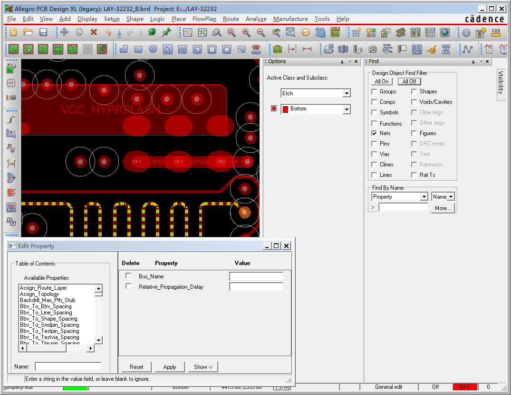

在过滤器里面输入Impedance*，点击Apply

输入数值all：all：50:5，

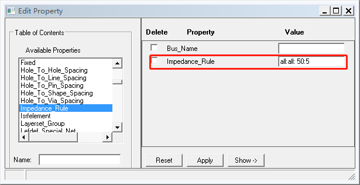

单击Apply，如下图所示

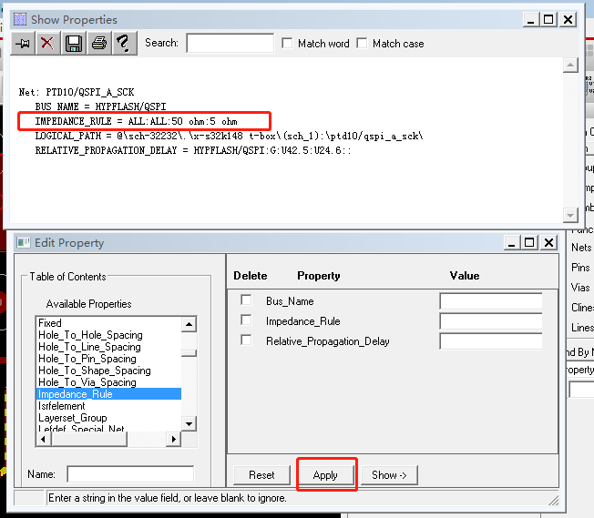

单击OK，结束命令。

然后打开检查模式，在 Setup-Constraints-Modes... , 在弹出的窗口中，将电气模式下的抗检查打开,如下图所示

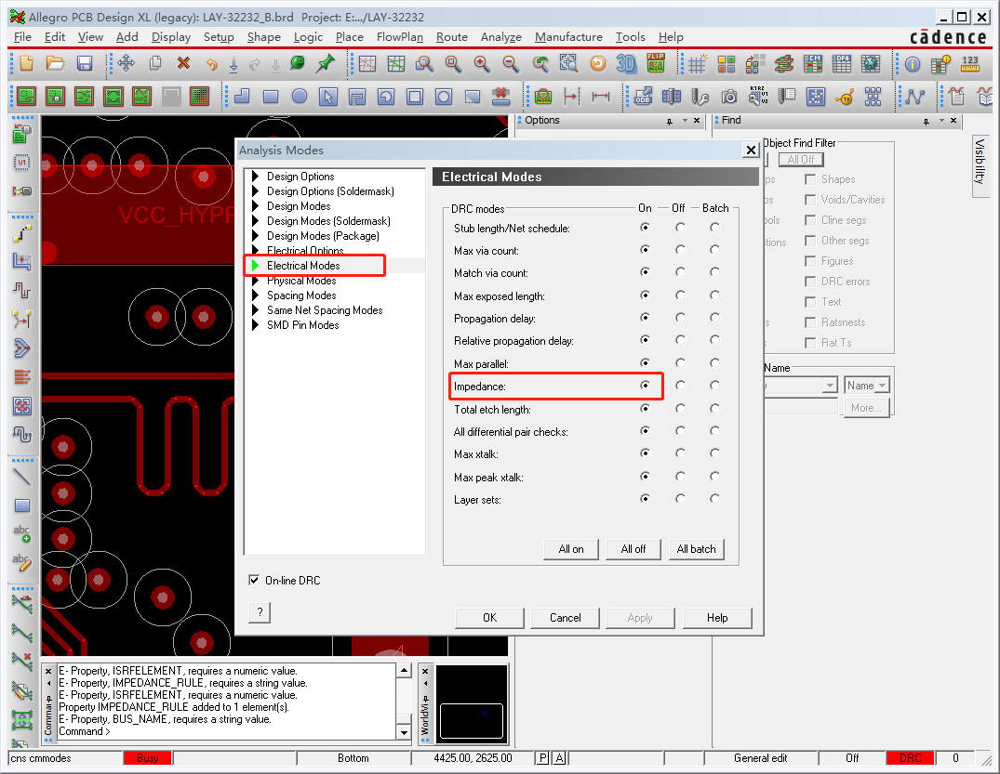

单击Apply ，违反规则，就会出现一个DRC 

####    1.5.2 在约束管理器中设置

在约束管理器中，点选Impedance，如下图所示

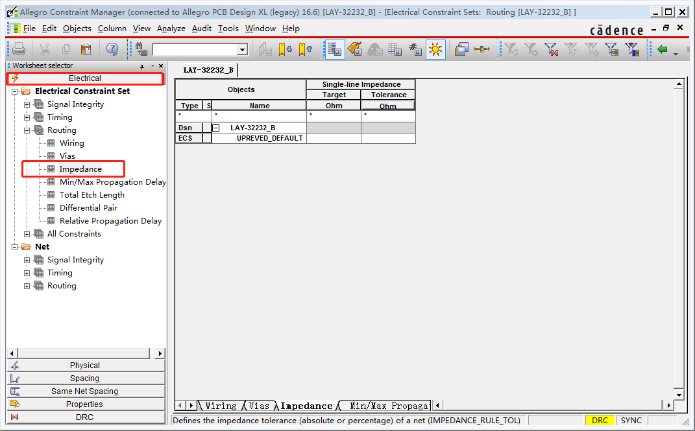

在cds_2上，右键Create-Electrical CSet，输入名称50ohm，单击OK，回到工作簿，设置其值，如下图所示

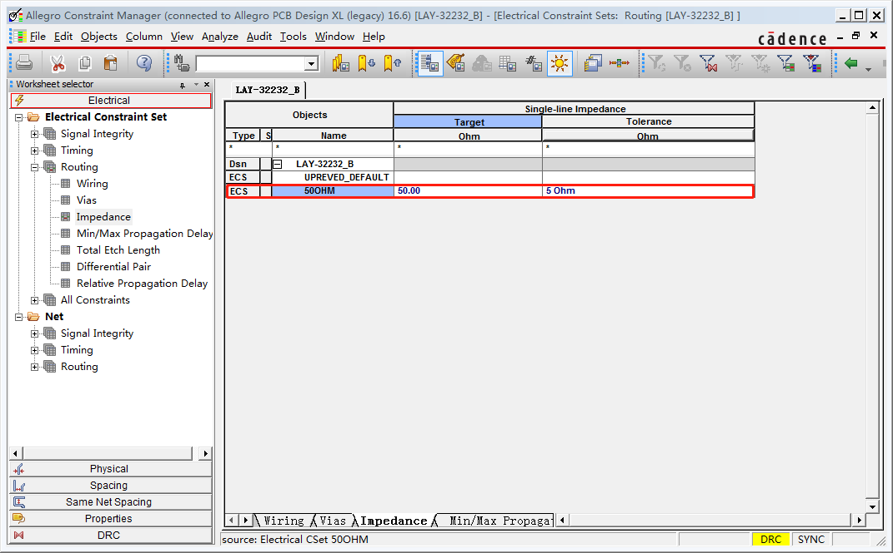

然后为所需要设置的网络分配规则，如下图所示

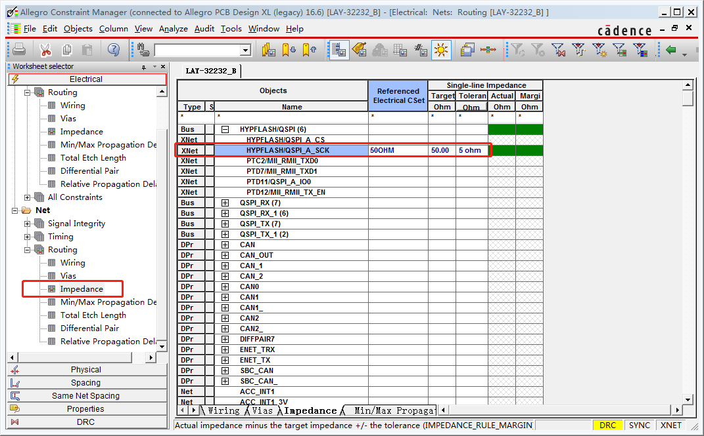

然后再打开检查模式，如下图所示

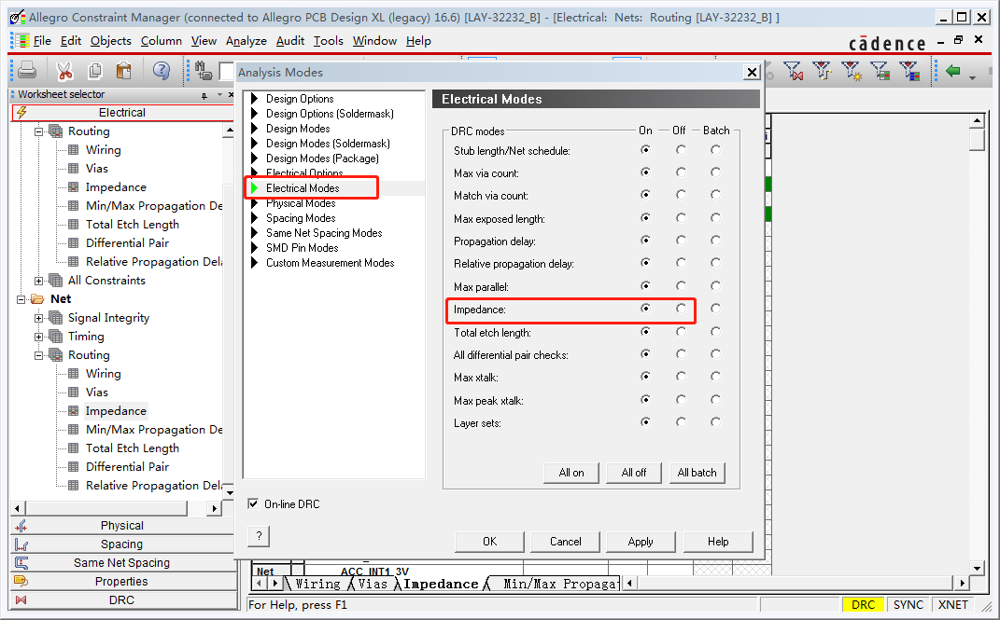

### 1.6 走线的长度范围设置

语法说明：  
PROPAGATION_DELAY＝A：B：C：D  
A：起点PIN  
B：终点PIN  
如果是整条NET 只有2 个PIN 时，在A 处写入L，在B 处写入S  
C：最小线长  
D：最大线长  
例如：  
PROPAGATION_DELAY＝U1.4：U2.8：1000mil：1500mil  
设定U1.4到U2.8的走线长度为1000MIL到1500MIL之间  
PROPAGATION_DELAY＝L：S：1000mil：1500mil  
设定整条NET 的走线长度为1000MIL到1500MIL 之间  

####    1.6.1 通过Edit Property设置

执行 Edit /Porperties 命令，单击一个网络，选择PROGATION_DELAY 并输入其数值，如下图所示。

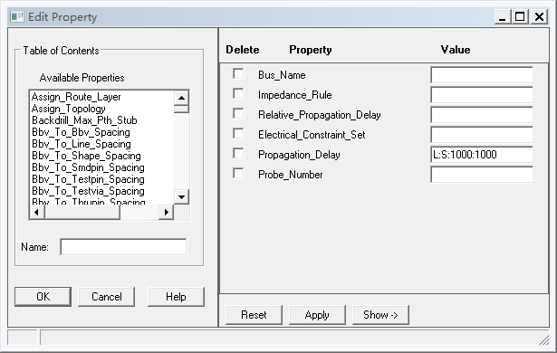
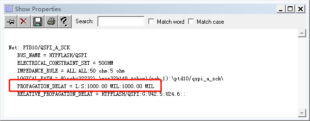

然后再开启检查模式，Setup-Constraints-Modes...

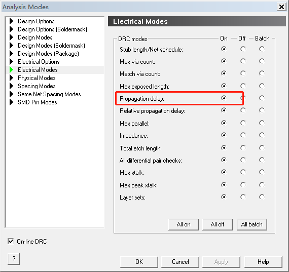

####    1.6.2 在约束管理器中设置

在Electrical Constraint Set 点选 Min/Max Propagation Delays 在 ECS上右键选择Create-Electrical CSet ，设定其值

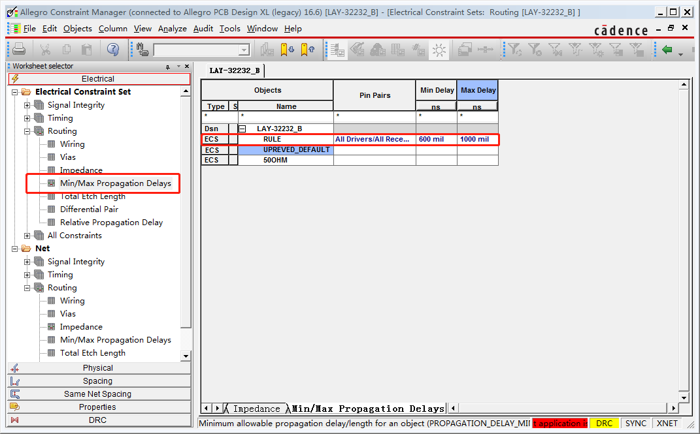

为网络分配约束，如下图所示

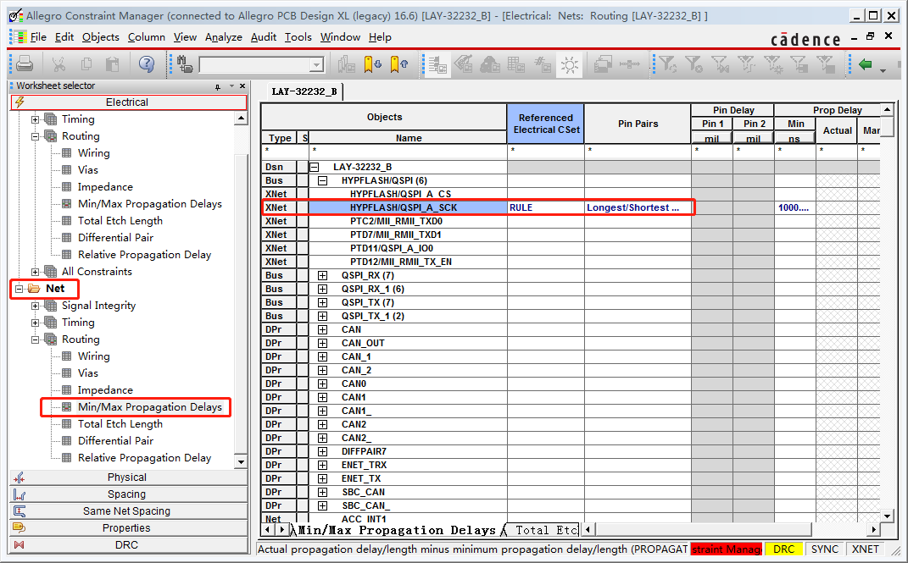

再打开检查模式，Analyze-Analysis Modes...

将电气规则下的，Propagation delay 检查模式打开。走线模式时，即可辅助线束走线状态。

####    1.6.2 在原理图中设置

Capture中选择网络 ，编辑网络属性 Property Edit ，在属性编辑器中选 Cadence-Allegro 和 Flat Net ，找到 PROPAGATION_DELAY 项 ，右键 / Invoke UI 对 PROPAGATION_DELAY 设定其值

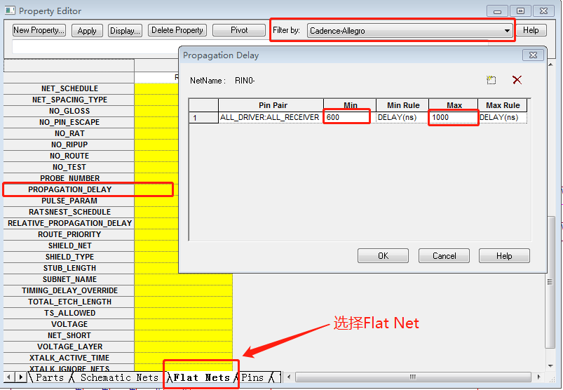

输出 Netlist 到 Allegro。进入Allegro后即可看到Properties

再开启检查模式。走线模式时，即可辅助显示走线状态

