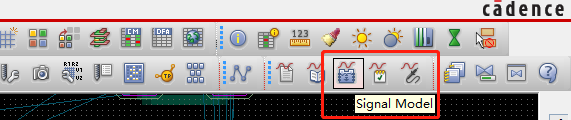

#   Allegro 约束规则设置（三）

##  一、基本约束规则设置

### 1.7 等长设置

语法说明：
RELATIVE_PROPAGATION_DELAY＝A：B：C：D：E：F  
A:组名。不用和BUS_NAME 名相同，在设定MATCH_GROUP时注意这一点。  
B：是GLOBAL，在B位写入G 即可  
C：起点PIN  
D：终点PIN  
如果NET只有2 个PIN时，C处写L，D 处写S。  
E：写入要比参照线（Target）长或短的数值  
F：长度的误差（也可以用百分比表示）

####    1.7.1 不过电阻的NET 等长

打开约束管理器，选择一组NET，右键创建MATCH_GROUP，如下图所示。

然后设定其值

然后设置一个网络为目标网络，在网络Delta：Tolerance 栏处右键选择Set as target，如下图所示

再打开检查模式。如下图所示

####    1.7.2 过电阻的XNET 等长

这里关键是设置XNET。假设有一排过电阻的线需要等长

首先创建电阻模型。单击Signal Model 图标，如下图所示

点击电阻，如下图所示，单击 RS4_RS0603X4_RS4 RS4 , 同类型的器件全部被选中 ，单击 Create Model。。。按钮。默认，单击OK

默认单击OK。如下图所示。

再单击 OK 结束命令。

假设我们要将 ED24 到 ED27 网络等长。

打开约束管理器，选择相对延迟，这里可以看到我们刚才设置的XNET。
我们在 ED24 网络上右键创建PIN PAIR

选择2个端点，如上图所示，单击OK。

同理，其他需要设置等长的网络，也创建PIN PAIR。

然后按住Ctrl 键选择这些PIN PAIR，右键创建MATCH GROUP 如下图所示

设定约束值，及目标网络，方法同不过电阻网络等长设置

####    1.7.3 T型等长

T型等长设置，比如两个 Memory之间的等长就属于T型等长，设置方法如下

首先添加T型连接点。点击Logic-Net Schedule，单击你要设置网络的一个pin。如下图。

在中间右键Insert T，加入T型连接点，然后去点击第二个pin，再回到T 型连接点，然后去点击第三个pin，右键done即可。

创建的T型连接点如下图所示

这只是创建了一个网络的T 型连接点，如果需要创建多个，可点击进入约束管理器设置。在Net-Routing——Wiring下面，刚才设置的网络拓扑便会显示成UserDefined。如下图所示

选中那个网络，右键创建Creat-Electrical CSet，如下图

然后将你需要设置T 型结构的网络选择刚才设置的ECSet 作为参考,Verify Schedule选择yes即打开验证，如下图所示。

然后打开检查模式，在约束管理器Analyze-Analysis Modes 弹出的对话框中，将Stub length/Net 的检查模式选择为on

然后选中你设置的网络右键Analyze，看看是否通过，为绿色pass即可 ，再回到pcb，打开飞线，看看是否都有了T 型连接点，如下图所示

然后在回到约束管理器，将刚才设置的T型结构的网络选中，右键Creat-Net GROUP，如下图所示。

选中所创建的 Net GROUP，右键 SigXplorer，如下图所示

  

这里可以看到刚才设置的拓扑结构，单击Set 菜单下Constraints子菜单，如下图所示，选择Rel Prop Delay面板

创建两个约束，注意这里设置的是从T1 到U7 和T1 到U8，即U7 和U8 之间T型等长，约束名称是一样的，范围Scope选择Local，如下图所示

设置好之后，单击Update Cm图标更新回约束管理器，如下图所示

再回到约束管理器下Net-Routing-Relative Propagation Delay就可以看到刚才设置的约束ECS2_M1 了，如下图所示。

然后再打开检查模式，在Analyze 下Analysis Modes，将Relative propagation检查模式设置为on

