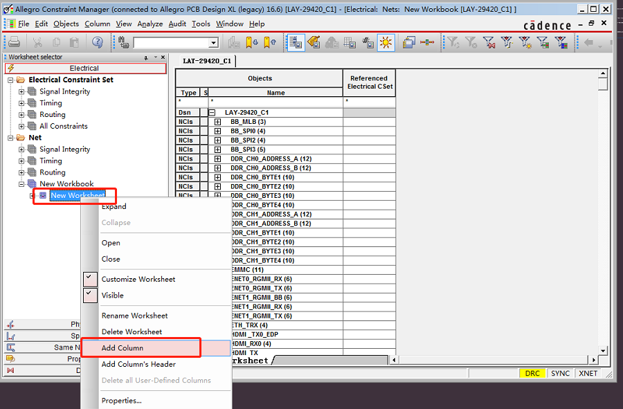
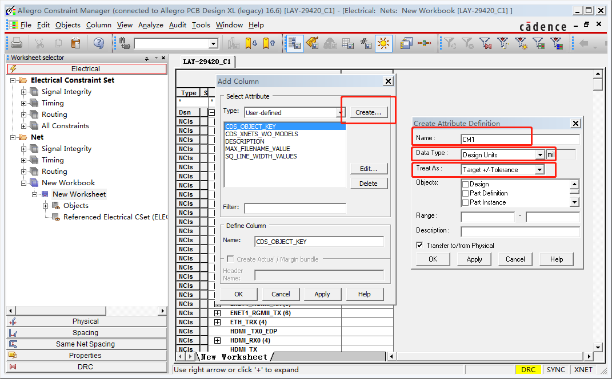
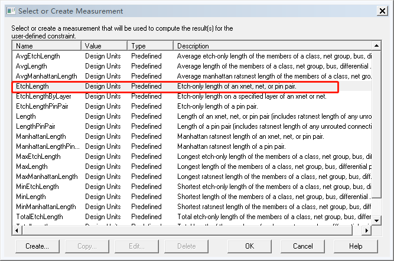
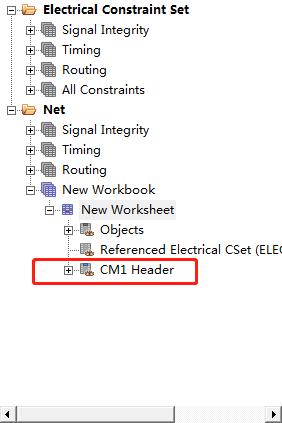
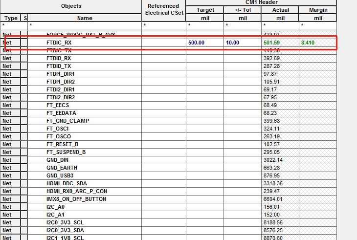

#   Allegro 约束规则设置（四）

##  一、基本约束规则设置

### 1.8 通用属性

若以NET常用的property为例  
#MIN_LINE_WIDTH 最小线宽  
#BUS_NAME BUS名称  
#NO_RAT 隐藏鼠线  
#FIXED 将器件固定  

####    1.8.1 通过Edit /Porperties命令设置

执行Edit /Porperties，点击你要设置属性的网络（右键TempGroup 可以选择多个网络），在弹出的属性编辑对话框中选择相应的Porperties并设定Value 即可

####    1.8.2 在约束管理器中设置

约束管理器选择 Properties 标签下的 General Properties选项，选择栏位并设定其值即可，如下图所示

BUS_NAME等属性也可以通过原理图设置好，然后在Allegro 中导入网表的方式来设置。

### 1.9 差分规则设置

####    1.9.1 创建差分对

*   通过 Logic > Assign Differential Pair 创建

执行Logic > Assign Differential Pair命令，先给一个差分名称，并将两条线的Net name 加进来完成设
定。也可以用自动产生方法产生。
使用Auto Differential pair generator自动产生配对线  
Ex: usb1n 、usb1p 两条线，将对线的+/-字元分别填写至 + polarity与- polarity属性中，点选Generate，产生差分对

*   在约束管理器中创建

打开约束管理器，定位到Differential Pair下，如下图所示

执行Objects-Ctreat-Differential Pair...命令

点击Auto Setup...可自动设置。也可手动设置，在左边选择网络，双击出现在右边已选择的网络里，点击Creat 即可。如下图所示

*   在原理图中创建

在原理图中执行 Tools/Create Differential Pair ，然后通过导入网表方式即可将其Diff Pair 设定自动导入

####    1.9.2 设置差分约束

打开约束管理器，定位到Differential Pair下，在右边工作簿中可以设置一些差分对的常用参数，比如Static Phase、Prim Gap、Prim Width如下图所示

然后执行Analyze-Analysis Modes...，打开差分对的检查模式

##  二、高级约束规则设置

### 2.1 单个网络长度约束

打开约束管理器。在电气规则Net 栏下右键并选择 CustomizeWorksheet ，然后再在Net 栏右键并选择Add New Workbook 命令，就会生成一个New Workbook子栏，双击NewWorkbook 

然后在New Workbook栏上右键并选择Add Column 命令 

单击Create...按钮 ，弹出的对话框中如下设置 ，单击OK 

取一个名称，这里命名为CM1
Data Type设为Design Units
Treat As设置为Target/Tolerances

弹出如下窗口，选择测试方法，选择EtchLength，然后单击OK

回到Ａｄｄ Ｃｏｌｕｍｎ对话框 ，选中 CM1  单击ＯＫ 出现一个警告框，不用管它，单击确定。如下图所示

然后设置网络约束值，如下图所示

然后在ｓｔａｒｔ上右键Ａｎａｌｙｚｅ，如下图所示

通过的就会已绿色线束，不通过的会以红色显示这样就可以为单个不同的网络设置不同的目标值及误差范围

