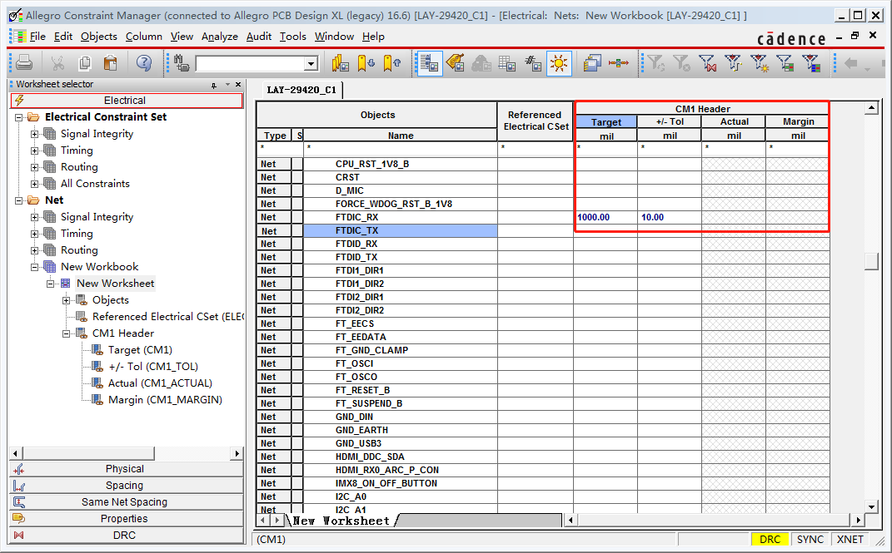
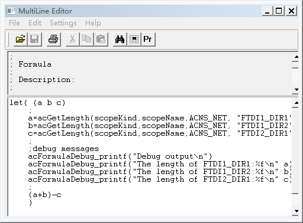

#   Allegro 约束规则设置（五）

##  二、高级约束规则设置

### 2.1 单个网络长度约束

打开约束管理器。在电气规则Net 栏下右键并选择 CustomizeWorksheet ，然后再在Net 栏右键并选择Add New Workbook 命令，就会生成一个New Workbook子栏，双击NewWorkbook 


然后在New Workbook栏上右键并选择Add Column 命令 


单击Create...按钮 ，弹出的对话框中如下设置 ，单击OK 

取一个名称，这里命名为CM1
Data Type设为Design Units
Treat As设置为Target/Tolerances


弹出如下窗口，选择测试方法，选择EtchLength，然后单击OK


回到Ａｄｄ Ｃｏｌｕｍｎ对话框 ，选中 CM1  单击ＯＫ 出现一个警告框，不用管它，单击确定。如下图所示


然后设置网络约束值，如下图所示



然后在ｓｔａｒｔ上右键Ａｎａｌｙｚｅ，如下图所示


通过的就会已绿色线束，不通过的会以红色显示这样就可以为单个不同的网络设置不同的目标值及误差范围

### 2.2 a+b-c 类长度约束

比方说这里要设置FTDIC_RX 网络的目标值为FTDI1_DIR1网络和FTDI1_DIR2 网络长度之和减去FTDI2_DIR1 网络长度。这个值是动态的，如果FTDI1_DIR1 或者FTDI1_DIR2或者FTDI2_DIR1 长度有变化，FTDIC_RX 网络目标约束值也随着改变。
单击Tools-Options，保证Formulas栏的2项是被选中的，默认是选中的。如下图所示


然后在FTDIC_RX 网络的Target栏右键并选择Formula命令


在出现的对话框中，单击MultiLine Editor...按钮，如下图所示




将下面 “a+b-c“公式代码复制到编辑器 

```
let( (a b c)
    ;
    a=acGetLength(scopeKind,scopeName,ACNS_NET, "FTDI1_DIR1")
    b=acGetLength(scopeKind,scopeName,ACNS_NET, "FTDI1_DIR2")
    c=acGetLength(scopeKind,scopeName,ACNS_NET, "FTDI2_DIR1")
    ;
    ;debug messages
    acFormulaDebug_printf("Debug output\n")
    acFormulaDebug_printf("The length of FTDI1_DIR1:%f\n" a)
    acFormulaDebug_printf("The length of FTDI1_DIR2:%f\n" b)
    acFormulaDebug_printf("The length of FTDI2_DIR1:%f\n" c)
    ;
    (a+b)-c
    )
```
单击File-Text，查看测试结果，如下图所示


回到MultiLine Editor对话框，单击保存，并关闭对话框。

这 样 FTDIC_RX 目标长度约束值自动修改为FTDI1_DIR1+FTDI1_DIR2-FTDI2_DIR1之和


### 2.3 a+b-c 在最大和最小传播延迟中的应用

在电气规则NET 下选择Min/Max Propagation Delays，如下图所示


Select Unit Type 选择为Design Unit

单击Formula Browser，再弹出的对话框中选择 a+b-c 单击OK

单击MultiLine Editor...按钮 将（a+b）-c修改为(a+b)-c-25


保存并关闭窗口回到约束管理器，在FTDIC_RX 网络的Min Pro Delay栏右键选择Copy ，然后在右边的Max Pro Delay处右键Paste


单击那个刚才Max Pro Delay那个方框，弹出MultiLine Editor窗口，将(a+b)-c-25修改为(a+b)-c+25


这样最小值就设为了(a+b)-c-25，最大值设为了（a+b）-c+25


